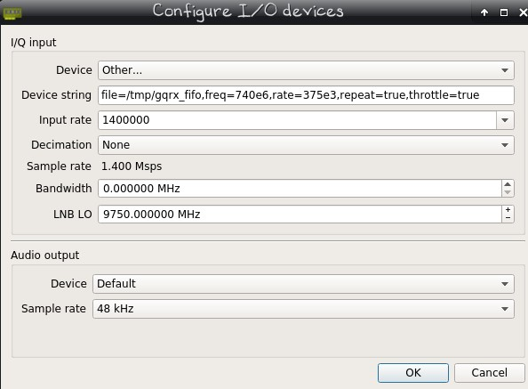
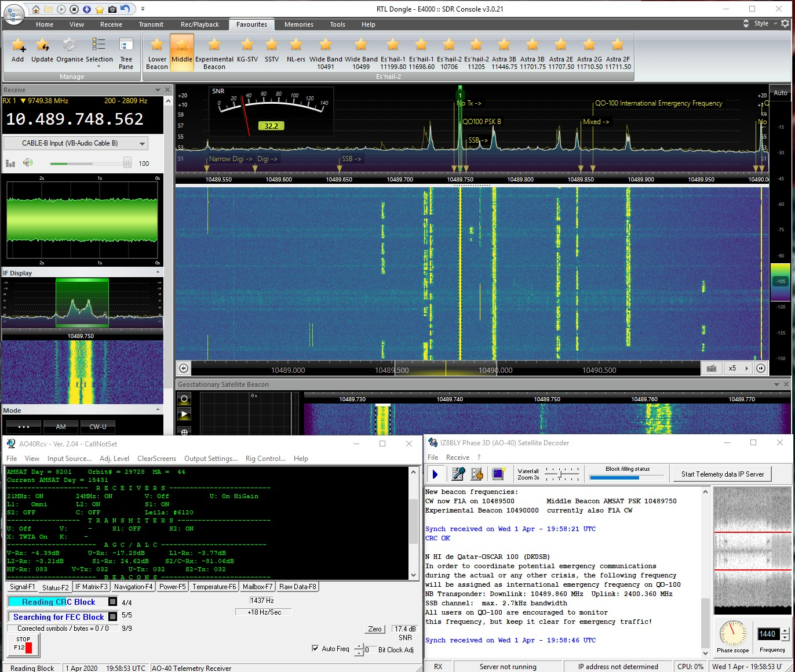

<!DOCTYPE html>
<html class="no-js" lang="en">
  <head>
    <meta http-equiv="content-type" content="text/html; charset=UTF-8">
    <meta charset="utf-8">
    <meta http-equiv="x-ua-compatible" content="ie=edge">
    <meta name="description" content="">
    <meta name="viewport" content="width=device-width, initial-scale=1">
  </head>
  <body>
    

      
 
        

          <h1> Es-Hail-2 Oscar-100
            &nbsp;&nbsp;&nbsp;&nbsp;&nbsp;&nbsp;&nbsp;&nbsp;&nbsp;&nbsp;&nbsp;&nbsp;&nbsp;&nbsp;&nbsp;&nbsp;&nbsp;&nbsp;&nbsp;&nbsp;&nbsp;&nbsp;&nbsp;&nbsp;&nbsp;&nbsp;&nbsp;&nbsp;&nbsp;&nbsp;&nbsp;&nbsp;&nbsp;&nbsp;&nbsp;&nbsp;&nbsp;&nbsp;&nbsp;&nbsp;&nbsp;&nbsp;&nbsp;&nbsp;&nbsp;&nbsp;&nbsp;&nbsp;&nbsp;&nbsp;&nbsp;&nbsp;&nbsp;&nbsp;&nbsp;&nbsp;&nbsp;&nbsp;&nbsp;&nbsp;&nbsp;&nbsp;&nbsp;
          </h1>
           
          Es’hail-2 (QO-100) is a geostationary satellite in orbit at
          25.9° East carrying amateur radio transponders. 
          It's reception footprint covers Africa, Europe, the Middle
          East, India, eastern Brazil and the west half of Russia/Asia. 
          A a joint project by the Qatar Satellite Company (Es'hailSat),
          the Qatar Amateur Radio Society (QARS) and AMSAT Deutschland
          (AMSAT-DL). 
           
           
           
          Es’hail-2 (QO-100) carries two amateur radio transponders, a
          vertical polarized narrow band linear transponder (downlink
          10489.550 - 10489.800 MHz). 
          And a horizontally polarized wide band digital transponder for
          amateur digital TV DATV (downlink 10491.000 - 10499.000 MHz.). 
          
 

          

            
Contents: 

            <ul>
              <li>Hardware
                <ul>
                  <li>1.1&nbsp; <a href="#Satellite_Dish_">Satellite
                        Dish</a> 
                    </li>
                  <li>1.2&nbsp; <a href="#LNB_">LNB</a> 
                    </li>
                  <li>1.3&nbsp; <a href="#SDR_Radio_">SDR Radio</a> 
                    </li>
                  <li>1.4&nbsp; <a href="#Bias-Tee_">Bias-Tee</a></li>
                  <li>1.5&nbsp; <a
                        href="#Point_Dish_to_Es%E2%80%99hail-2_">Point
                        Dish</a></li>
                  <li>2.0&nbsp; <a href="#Narrow_Band_">Narrow
                        Band Transponder</a> 
                    </li>
                  <li>2.1&nbsp; <a href="#Software_">Software</a></li>
                  <li>2.2&nbsp; <a href="#WebSDR_">WebSDR</a>&nbsp;  
                  </li>
                  <li>2.3&nbsp; <a
                      href="#Es-Hail_Beacon_Tracker_Linux_">Beacon
                      Tracker Linux</a> 
                  </li>
                  <li>2.4&nbsp; <a href="#Telemetry_beacon_">Telemetry
                      Beacon</a> 
                  </li>
                  <li>2.5&nbsp; <a href="#Wide_Band_">Wide Band
                      Transponder 
                    </a></li>
                  <li>2.6&nbsp; <a href="#Software_DVB-S_Demodulator_">Software
                      DVB-S Demodulator</a></li>
                  <li>2.7&nbsp; <a
                      href="#Custom_DATV_Firmware_for_the_Pluto">Custom
                      DATV Firmware for Pluto</a> 
                  </li>
                  <li>2.8&nbsp; <a href="#Usefull_Links_">Usefull Links</a> 
                  </li>
                </ul>
              </li>
            </ul>
          

          <h2>Satellite Dish </h2>
          For reception of Es’hail-2 (QO-100) you need a dish in size
          &gt;40 - 80 cm for the Narrow Band. 
          A size between 80 - 1.20 cm or more for the Wide band
          transponder is needed. 
           
           
           
          Im using my old 1.50 Mtr Primefocus pointed to Astra 23 East
          for TV Reception. 
          But offset dishes work off course fine to. 
           
           
           
          <meta http-equiv="content-type" content="text/html;
            charset=UTF-8">
          Bullseye BE01 LNB on the left/bottom so it points to 25,9 East
          Es’hail-2. 
          <h2>LNB 
          </h2>
          The <a
            href="https://www.rtl-sdr.com/buy-rtl-sdr-dvb-t-dongles/"
            target="_blank">Othernet Bullseye BE01</a> is stable and
          precise LNB with a tunable TCXO instead of plain crystal
          oscillator.  
          It does not need a internal modification to receive the narrow
          or wide QO-100 transponder. 
           
           
           
          A second output F (red) is available to benefit from the 25
          Mhz reference signal output in order to control another device
          or to check the stability. 
          Normal outdoor use (25°C), the frequency offset is well within
          10 kHz of offset thanks to its integrated 2ppm TCXO and a 25
          Mhz reference. 
           
          Satellite TV (DRO/PLL-based) LNBS can be used for Es'hail-2,
          but it is not recommend. 
          Regular Ku-band Satellite TV LNBS suffer from drift in
          frequency making it more difficult to keep a stable reception
          for the narrow band signals. 
          Because of outside conditions (temperature changes, sun,
          clouds, wind ect). 
           
           
           
          Specifications: 
           
          Input frequency: 10489 - 12750 MHz 
          LO frequency 9750/10600 MHz 
          LO frequency stability at 23C: +/- 10 kHz 
          LO frequency stability -20 - 60C: +/- 30 kHz 
          Gain: 50 - 66 dB 
          Output frequency: 739 - 1950 MHz (low band) and 1100 - 2150
          (high band) 
          Return loss of 8 dB (739 - 1950 MHz) and 10 dB (1100 - 2150
          MHz) 
          Noise figure: 0.5 dB 
           
          Features: 
           
          Bullseye 10 kHz BE01 
          Universal single output LNB 
          Frequency stability within 10 kHz in normal outdoor
          environment 
          Phase locked loop with 2 PPM TCXO 
          Factory calibration within 1 kHz utilizing GPS-locked spectrum
          analyzers 
          Ultra high precision PLL employing proprietary frequency
          control system (patent pending) 
          Digitally controlled carrier offset with optional programmer 
          25 MHz output reference available on secondary F-connector
          (red) 
           
          Testing results over here on my station with regular Goobay
          PLL LNB compared to the Othernet Bullseye LNB shows clearly a
          huge increase of frequency stability. 
          A must have LNB :) 
          <h2>SDR Radio 
          </h2>
           
          &nbsp;&nbsp;&nbsp;&nbsp;&nbsp;&nbsp;&nbsp;&nbsp;&nbsp;&nbsp;&nbsp;&nbsp;&nbsp;&nbsp;&nbsp;&nbsp;&nbsp;&nbsp;&nbsp;&nbsp;&nbsp;&nbsp;&nbsp;&nbsp;&nbsp;&nbsp;&nbsp;&nbsp;&nbsp;&nbsp;&nbsp;&nbsp;&nbsp;&nbsp;&nbsp;
           
           
          Any SDR radio should work fine on Es'hail-2 for reception. 
          E4000 Terratec and Adalm-Pluto are in use overhere. 
           
           
           
          Coax sat splitter to feed both SDR Radio's. 
          <h2>Bias-Tee 
          </h2>
          LNB Polarisation switching is controlled by DC voltage
          supplied by the satellite receiver normally. 
          12.5v to 14.5v gives vertical and 15.5 to 18v gives horizontal
          polarisation. 
          A Bias-Tee is needed, there are a few ways to achieve this
          from <a href="http://www.oe8hsr.at/blog/?p=476"
            target="_blank">DIY</a> or Internet buying. 
           
          It is also possible to use a (old) Satellite receiver to act
          as a Bias-Tee. 
           
           
           
          Any (FTA) DVB-S Digital sat-receiver will work as long it has
          a separate LNB-Output. 
          Which can be connected to the SDR-Radio or Split-ted to feed 2
          SDR radio's. 
           
          The Narrow Band of Es’hail-2 Transponder is vertical, so to
          get signal on this part of the band a channel with vertical
          polarization is needed. 
          It does not matter if there is any actual signal on the pre
          programmed channel frequency only the switch of polarization
          matters. 
          Same for the Wide Band as it is Horizontal Polarized. 
          <h2>Point Dish to
            Es’hail-2 </h2>
          There are several ways to find Es’hail-2 in the sky, <a
            href="https://www.dishpointer.com" target="_blank">dishpointer
            has a good website and app.</a> 
          Es’hail-2 is positioned at 25,9 Degrees East. 
           
          Together with Badr 4 - 7 and Es’hail-1, roughly between two
          Digital TV Satellites Astra 3B and Astra 2E/F and G at 28,2
          Degrees East. 
          Which make it a lot easier to find with a satellite receiver
          or just only the SDR looking for the <a
href="http://frequencyplansatellites.altervista.org/Beacon-Telemetry_Europe-Africa-MiddleEast.html"
            target="_blank">satellite beacon frequency</a> looking like
          <a
href="http://frequencyplansatellites.altervista.org/Beacon-Telemetry_Europe-Africa-MiddleEast/Eutelsat_25B.html"
            target="_blank">this</a>. 
           
          Using any (FTA) DVB-S Digital sat-receiver will work. 
          25,9 East position carries also DVB TV Channels but they are
          broadcasted at a different beam with a smaller footprint, only
          very big dishes can receive outside the footprint. 
          However both beacon frequencies from Es’hail-1 and 2 are quite
          strong at 10706 V and 11205 V. 
           
          Let the satellite receiver scan <a
            href="https://nl.kingofsat.net/tp.php?tp=502"
            target="_blank">Astra 28.2 East Transponder 44 ITV1 London
            10.758 V DVB-S QPSK Sr:22000 Fec 5/6.</a> 
          And <a href="https://nl.kingofsat.net/tp.php?tp=499"
            target="_blank">Astra 28.2 East Transponder 41 Channel 4
            107.14 H DVB-s QPSK Sr:22000 Fec 5/6 </a> 
          &nbsp;  
          Use the details from Dishpointer to align the dish and swing
          around until you got picture on ITV1 it should be FTA. 
           
          Connect LNB-out from the satellite receiver into the SDR. 
          Tune in to 740MHz in SDR# 
           
          Just turn the dish a little to the right (when standing behind
          the dish). 
           
           
           
          And the Narrow Band SSB signals and beacons should be visible
          in SDR#. 
           
          For wide band tune the satellite receiver in to Channel 4
          Transponder 41. 
          Now try to find the DATV Beacon on 10.4915. 
           
           
           
          DATV Beacon on RTL-SDR E4000 
           
           
           
          DATV Beacon on Pluto-SDR 
           
          It look like a sort of hump of signal, should be visible
          around 741MHz in SDR#. 
          Align until the max signal is received.  
           
           
           
          Es’hail-2 Footprint 
          <h2>Narrow Band Transponder 
          </h2>
          The Narrow Band on Es’hail-2 (QO-100) is a vertical polarized
          linear transponder. 
          With Downlink on 10489.550 - 10489.800 MHz. 
           
          Modulation is USB and image below shows what modes are allowed
          and how they are specified: 
          &nbsp;  
          Some of the very popular programs/modes used on Narrow Band
          SSB are: 
          <a href="http://www2.plala.or.jp/hikokibiyori/soft/kgstv/"
            target="_blank">KG-STV</a>, <a
            href="http://users.belgacom.net/hamradio/rxsstv.htm"
            target="_blank">SSTV</a>, <a
            href="http://g0hwc.com/sstv_drm_news.html" target="_blank">EasyPal</a>,
          <a href="http://uz7.ho.ua/packetradio.htm" target="_blank">AX-25
            Packet Radio</a>, <a href="https://freedv.org/"
            target="_blank">FreeDV</a> and many more. 
          <h2>Software 
          </h2>
          SDR Console is by far the best operating SDR software for
          Narrow Band mode. 
           
           
           
          <a href="https://www.sdr-radio.com/EsHail-2#TelemetryBeacon"
            target="_blank">With an option to synchronising the
            Telemetry beacon for better frequency stability.</a> 
           
           
           
          SDR Console receiving KG-STV and SSTV on Es’hail-2 (QO-100)
          Narrow Band Transponder. 
           
           
           
          With a simple modification <a
            href="https://airspy.com/download/" target="_blank">SDR#</a>
          can be used for the Pluto-SDR: 
          <a href="https://github.com/Manawyrm/sdrsharp-plutosdr"
            target="_blank">Analog Devices ADALM-PlutoSDR driver for
            SDR#</a> 
           
          However there is no drift correction (plugin) available! 
          <h2>WebSDR 
          </h2>
          There are a few WebSDR available to see the Narrow band Live
          in action: 
           
          <a href="https://eshail.batc.org.uk/nb/" target="_blank">Official
            Qatar-OSCAR 100 Narrowband WebSDR</a> 
           
          <a href="https://eshail.batc.org.uk/wb/" target="_blank">Official
            Qatar-OSCAR 100 Wideband Spectrum Monitor</a> 
           
          <a href="http://217.133.56.150:8901/" target="_blank">IS0GRB
            QO-100 (Es'Hail-2) WebSDR receiver</a> 
           
          <a href="http://appr.org.br:8902/noid.html" target="_blank">Es'HailSat-2
            (QO-100) WEBSDR - Brazil</a> 
           
          It is also possible to make a Narrow-Band or Wide-Band WebSDR
          of your QO-100 receiving Station. 
          With options like Auto Locking the Telemetry Beacon for better
          Frequency stability. 
          Works in any webbrowser local network or internet with support
          USB-Audio, SSTV ect. 
           
           
           
          <a
            href="https://github.com/dj0abr/QO-100_SSB-WebSDR_DATV-WebSpectrum"
            target="_blank">https://github.com/dj0abr/QO-100_SSB-WebSDR_DATV-WebSpectrum</a> 
          Supported are Raspberry-Pi, Adalm-Pluto, SDRPlay and the
          rtl-sdr usb sdr.  
          <h2>Es-Hail Beacon
            Tracker Linux 
          </h2>
          GNU Radio flowgraph for receiving the Geostationary QO-100 /
          Es'hailsat-2 narrowband amateur transponder. 
          Performing phaselocking to the PSK400 beacon for automatic LNB
          drift correction. 
           
          Usage: 
          Create new fifo object - execute mkfifo /tmp/gqrx_fifo command
          in linux terminal. 
           
          Start gnuradio-companion, open beacontrack_gqrx.grc flow and
          run it using "Play" button or F6 key. 
          Start GQRX and select Complex Sampled (IQ) File as input
          device. 
           
           
          &nbsp; 
          Provide the following settings: GQRX configuration 
          Start reception in GQRX using "Play" button or ctrl-D. 
           
          You should see both gqrx and grc workflow running. 
          beacontrack_gqrx_rtlsdr.grc 
          Input osmocom block is using rtl_tcp=0 as input string.  
          Sample rate is 1.5M with 4x decimation.  
           
          Use Frequency adjustment slider to move upper beacon about 110
          kHz above center frequency.  
           
           
           
          <a href="https://github.com/pe4wj/eshailsat2" target="_blank">Download
            Scripts and flowgraphs for the Es'hailsat-2 amateur
            transponder.</a>
          <h2>Telemetry beacon 
          </h2>
          There are 3 decode-able beacons CW Lower, PSK Middle and CW
          Higher Beacon. 
           
           
           
          The middle PSK beacon displays telemetry and other info, which
          is not directly broadcasted from the satellite but from the <a
            href="https://wiki.batc.org.uk/Es%27hail-2_Ground_Station"
            target="_blank">AMSAT Groundstation</a> instead. 
           
           
           
          <a href="http://antoninoporcino.xoom.it/P3D/index.htm"
            target="_blank">Phase 3D (AO-40) Decoder from IZ8BLY</a>
          works great on the QO-100 beacon also in Linux Wine. 
           
           
           
          Another <a href="http://www.moetronix.com/ae4jy/ao40rcv.htm"
            target="_blank">Decoder AO40Rcv</a> displaying more info. 
           
           
           
          Works in Linux Wine but does not display any text (as a
          workaround check Log to File in Options for a saved text file
          with beacon details). 
           
           
           
          <a
href="https://destevez.net/2019/02/decoding-the-qo-100-beacon-with-gr-satellites/"
            target="_blank">Decoding the QO-100 beacon with GNU-Radio
            gr-satellites</a>  
           
          Both CW Beacons can be used with <a
            href="https://sourceforge.net/projects/fldigi/files/fldigi/"
            target="_blank">FlDigi</a>, 
          or any other morse decoding program. 
          <h2>Wide Band Transponder 
          </h2>
          The Wide Band on Es’hail-2 (QO-100) is a horizontal polarized
          linear transponder. 
          With Downlink on 10491.000 - 10499.000 MHz. 
           
           
           
          DATV beacon parameters are center 10.4915, DVB-S2, QPSK 4/5
          FEC, 0.25 RollOff, C/N=4,6dB, 2,383 MBit 
          This requires a C/N of 4.6 dB for decoding, but the beacon
          power density has been increased so that reception should
          still be possible on dishes of 80 cm and larger. 
           
          Bandplan below shows what modes are allowed and how they are
          specified: 
           
           
           
           
           
          <a
            href="https://wiki.batc.org.uk/Receiving_Oscar_100_DATV_signals"
            target="_blank">More about receiving Oscar 100 DATV signals.</a> 
          <h2>Software DVB-S
            Demodulator 
          </h2>
          Over on the <a
href="https://forum.amsat-dl.org/index.php?thread/101-software-dvb-s-demodulator/&amp;pageNo=1"
            target="_blank">Amsat-DL forums</a> user Markro92 is
          developing a realtime Windows DVB-S demodulator with GUI.  
          The demodulator works with the RTL-SDR, Airspy, HackRF,
          SDRplay and PlutoSDR. 
           
          It can demodulate DVB-S and S2 signals with very low
          symbolrate on the Wideband Transponder.  
          So you do not need a modified lnb or modified satellite
          receiver.  
          Of course you can also see the amateur tv streams which people
          uplink their self. 
           
          To see if there is any stream active one can visit the <a
            href="https://eshail.batc.org.uk/wb/" target="_blank">Official
            Qatar-OSCAR 100 Wideband Spectrum Monitor</a>  
          And the stream the info is displayed which parameters in use
          symbol rate and mode dvbs(2) so you can adjust these settings
          in the Demodulator program.  
           
          Example DATV Promo beacon video on 10.4915, DVB-S2, QPSK,
          Sr:1500,&nbsp; 4/5 FEC. 
           
           
           
          1: Select SDR and start Device. 
          2: Select correct Frequency. 
          3: Tune into the middle of the stream, every little bit counts
          with the bandwidth from the SDR. 
          4: Select correct Symbolrate. 
          5: Select mueller and muller filter (for all lower symbolrates
          use the gardner filter). 
          6: Check box Carrier recovery Enabled, if you do this right,
          you should see more symbols inside the IQ plot.  
           
          Play with the Carrier Recovery Loop Gain and Damping Sliders
          until you can see a circle inside the IQ plot and set
          appropriate Baseband-Gain Settings without overdriving. 
          A valid QPSK constellation should also appear.  
          For weak signals, increasing gain and damping can be
          necessary.  
           
          If you see the QPSK constellation (4 dots), you can decrease
          the gain again. 
          Keep also your eyes on actual symbolrate (right under). 
          When symbolrate is going higher, slightly go 1 symbolrate up
          and down, the symbolrate must stay around 1500 or the chosen
          value. 
           
          MPEG-TS output is localhost, UDP at port 8888. 
          Open <a href="https://www.videolan.org/" target="_blank">VLC</a>
          and insert Network Stream: udp://@:8888 
           
           
           
          Or make Batch file with content: 
          "C:\Program Files\VideoLAN\VLC\vlc.exe" "udp://@:8888" 
           
          The latest version of the software will always be always
          available at <a
            href="http://v.1337team.tk/dvb-s_gui_amsat.zip?raw=true">http://v.1337team.tk/dvb-s_gui_amsat.zip</a> 
          <h2>Custom
            DATV Firmware for the Pluto 
          </h2>
          
 

          The guys from batc.org.uk came up with a excellent <a
            href="https://wiki.batc.org.uk/Custom_DATV_Firmware_for_the_Pluto"
            target="_blank">Wiki</a> about Flashing Custom Firmware for
          the Pluto SDR developed by F5OEO. 
          Offering a simple way to generate DATV DVB-S(2). 
          There is a video stream analyzer included with which you can
          easy adjust your video bitrate from <a
            href="https://obsproject.com/" target="_blank">OBS-Project</a>
          for the correspending SR. 
           
          The following parameters can be used for streaming: 
           
          URL : rtmp://192.168.2.1:7272/,437,DVBS2,QPSK,2000,23,Pass :
          ,Happysat, 
           
          Default URL from Pluto 
          Frequency in MHz: 437 
          Mode (DVBS/DVBS2): DVBS2 
          Constellation (QPSK,8PSK,16APSK): QPSK (only QPSK is valid in
          DVBS) 
          SymbolRate in KS (33-2000): 2000 
          FEC (12,23,34,67,78...): 23 
          CALLSIGN: Happysat 
           
          Change to your needs. 
           
          It is done in OBS by setting a RTMP Stream pointing to the
          Pluto-SDR. 
          In OBS Settings/Stream: 
           
           
           
          Every SR needs a different video bitrate for best results,
          rule of thumb is to set the video bitrate at about 75% of the
          SR.  
          And reduce the audio bitrate to the minimum, 32kbps with OBS,
          framerate 25, this can be done in output. 
           
           
           
          The sources box bottom left, you can add a input source this
          can be anything a image or live video streams ect. 
          In the control box select Studio Mode, and press streaming. 
           
          A QPSK carrier will be generated at 437MHz in about 5 seconds. 
          Which is perfectly receivable in the DVB-S Demodulator
          Program. 
           
           
           
          <h2>Usefull Links 
          </h2>
          
 

           
          <a href="http://live.cqsstv.com/max/#10GHz" target="_blank">SSTV
            RX Gallery</a> 
           
          <a
href="https://www.rtl-sdr.com/decoding-eshail-2-dvb-s2-realtime-in-linux-with-leandvb/"
            target="_blank">QO-100 Realtime Live Decoding with LeanDVB</a> 
           
          <a
href="http://zr6aic.blogspot.com/2019/06/setting-up-your-dbv-s2-decoder-for-qo.html"
            target="_blank">Setting up your DBV-S2 Decoder for QO-100
            (Eshail-2) on Linux</a> 
           
          <a href="https://www.rtl-sdr.com/buy-rtl-sdr-dvb-t-dongles/"
            target="_blank">rtl-sdr.com Bullseye LNB</a> 
           
          <a
href="https://www.rtl-sdr.com/the-othernet-bullseye-tcxo-lnb-for-qo-100-reception/"
            target="_blank">rtl-sdr.com Bullseye-tcxo LNB for QO-100
            Reception Review</a> 
           
          <a
href="https://othernet.is/products/bullseye-10-khz-ultra-high-stability-universal-lnb"
            target="_blank">Othernet Bullseye 10 kHz Ultra High
            Stability Universal Single LNB</a> 
           
          <a href="http://www.pabr.org/radio/otherlnb/otherlnb.en.html"
            target="_blank">Testing the Othernet "Bullseye BE01" LNB</a> 
           
        

  </body>
</html>
